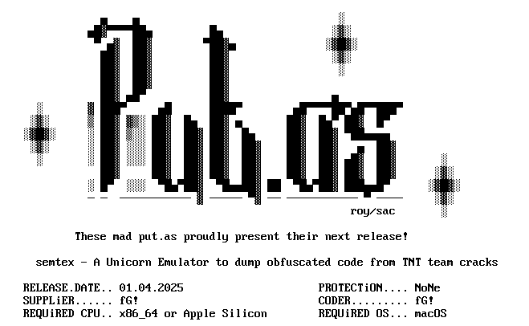

<p align="center"></p>

## About

🧨 semtex - A Unicorn Emulator to dump obfuscated code from TNT team x86_64 crack library

(c) fG!, 2025-2026 - reverser@put.as - [https://reverse.put.as](https://reverse.put.as)

This is a Unicorn Engine based emulator and dumper for x86_64 crack library from the TNT warez team.

Automatically locates all the necessary information and emulates the binary inside Unicorn Engine VM.

Dumps the obfuscated version which then can be analyzed in your favorite disassembler.

This could have been achieved in easier ways, but what's the fun in that. Unicorn is still one of my favorite tools and practice makes perfection :-).

Follow the corresponding blogpost [here](https://reverse.put.as/2025/03/13/cracking-the-crackers/).

Enjoy,  
fG!

## Greetings

The put.as team, TNT cracking team, Scott, #dc351, 0xOpoSec, and all the good friends around the world.

A special fuck you 🖕 to Ilfak.

## Usage

```bash
./semtex -i input binary -o output binary
```

Let it run and if everything went ok you should have the deobfuscated version in the configured output file.

It's ok that Unicorn is terminating execution with a `UC_ERR_EXCEPTION`. There is no full emulation since there isn't a target application where to apply the crack to.

***Note:*** The code only deals with non-fat binaries so you will need to `lipo` first if the target library if fat (for cracks that target both ARM64 and x86_64 macOS).

Example:
```bash
lipo -thin x86_64 -o nonfatlibrary.dylib fatlibrary.dylib
```

## Requirements

- Some x86_64 TNT crack that you want to dump. Usually found as `libC.dylib` or `libConfigurer64.dylib`, inside the `Resources` or `Frameworks` folders. Don't ask me where to get them :PPPP

- [Unicorn Engine](https://github.com/unicorn-engine/unicorn/releases) version >= 2.x

- [Zydis](https://github.com/zyantific/zydis): amalgamated version 4.1.0 is already included.
